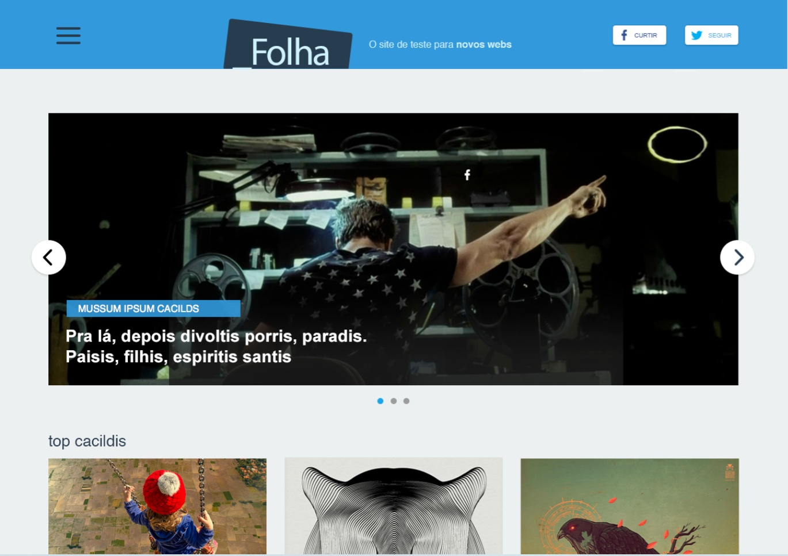
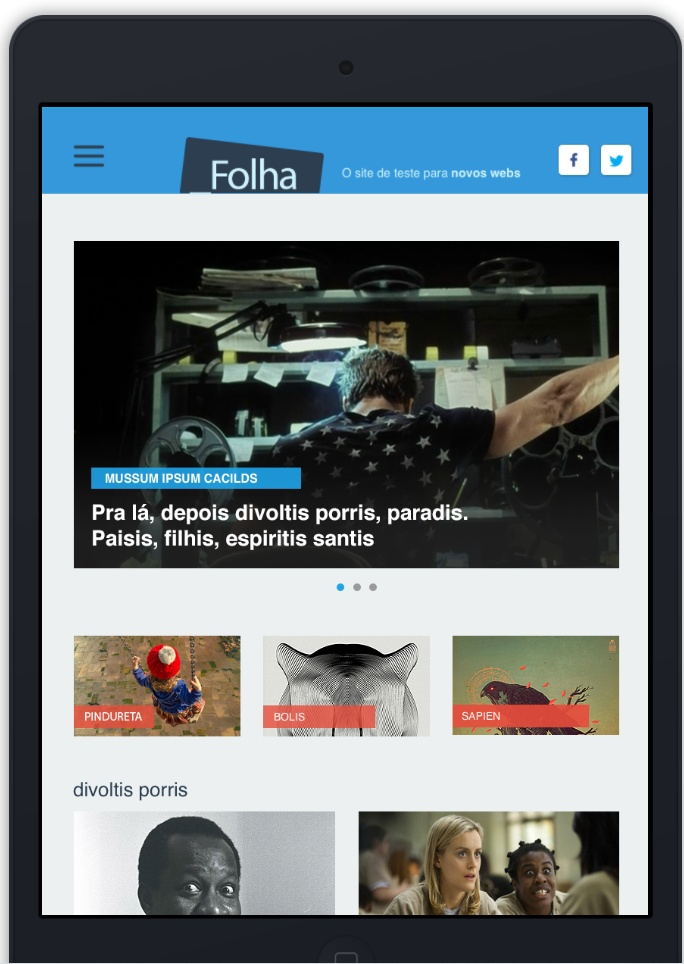

# Desafio Protarefa
> Esse projeto foi feito como processo seletivo para a vaga de desenvolvedor front-end junior da Protarefa. 

## Tabela da conteúdos
* [Informações gerais](#informações-gerais)
* [Screenshots](#screenshots)
* [Tecnologias](#tecnologias)
* [Setup](#setup)
* [Status](#status)
* [Contato](#contato)

## Informações gerais
O objetivo do desafio era criar o HTML/CSS responsivo com base no layout apresentado. O grid do layout foi baseado no Grid System do Bootstrap, mas não era permitido fazer usar nada além do Grid System, ainda sendo necessário faz os breakpoints e as modificações dependendo do device.

## Screenshots
### Versão Desktop

### Versão Tablet

### Versão Mobile

## Tecnologias
* HTML 5
* CSS 3
* Bootstrap - versão 4.5.2

## Setup
O projeto está hospedado no GitHub Pages, neste [link](https://ematheus23.github.io/processo-protarefa/). 

## Status
Projeto está: _finalizado_

## Contato
Criado por [@eMatheus23](https://github.com/eMatheus23/), caso queira, entre em contato comigo pelo e-mail: [elias.matheus@hotmail.com](elias.matheus@hotmail.com)
